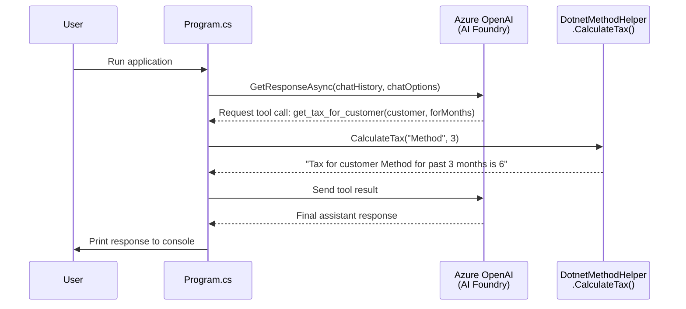
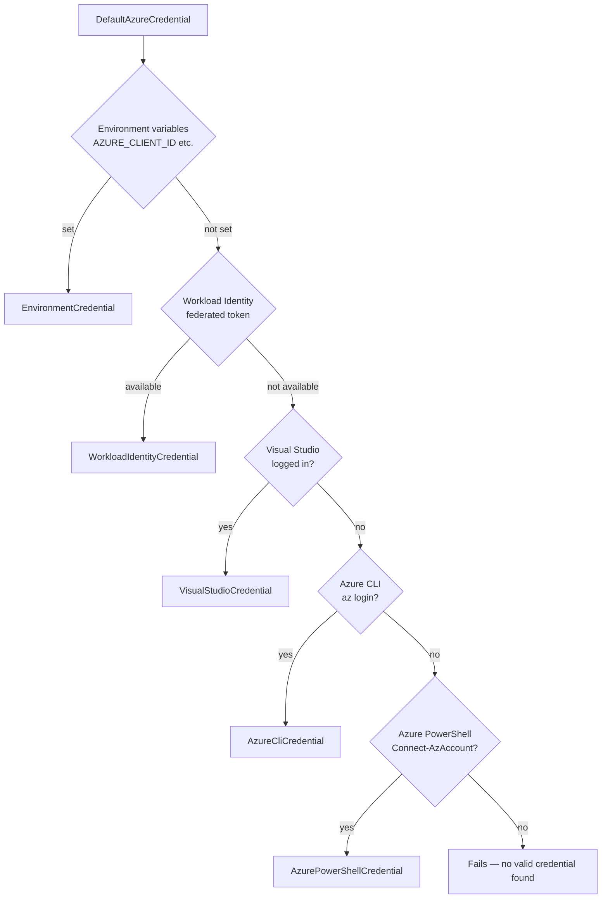
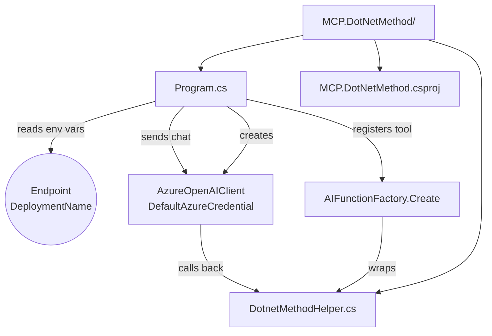

# MCP.DotNetMethod — .NET Method as an AI Tool

This example shows how to expose a plain .NET static method as an AI tool using `AIFunctionFactory.Create` from `Microsoft.Extensions.AI`, backed by an Azure AI Foundry deployment authenticated with `DefaultAzureCredential`.

## How it works

The application creates a chat client connected to Azure OpenAI, registers `DotnetMethodHelper.CalculateTax` as a tool named `get_tax_for_customer`, sends a user message, and lets the model decide when to invoke the tool.



## Prerequisites

| Requirement | Details |
|-------------|---------|
| .NET SDK | 10.0 or later |
| Azure subscription | Required to access Azure AI Foundry |
| Azure AI Foundry resource | With a chat-completion model deployed (e.g. `gpt-4o`) |
| Azure CLI or Visual Studio login | Used by `DefaultAzureCredential` for authentication |

### Authentication

This application uses [`DefaultAzureCredential`](https://learn.microsoft.com/en-us/dotnet/api/azure.identity.defaultazurecredential) from the `Azure.Identity` package. It tries the following credential sources in order:



Run `az login` or sign into Visual Studio before running the application locally.

## Environment Variables

Both variables must be set before running:

| Variable | Description | Example |
|----------|-------------|---------|
| `Endpoint` | Full URI of your Azure OpenAI resource | `https://my-resource.openai.azure.com/` |
| `DeploymentName` | Name of the chat-completion deployment | `gpt-4o` |

### Setting variables (PowerShell)

```powershell
$env:Endpoint = "https://my-resource.openai.azure.com/"
$env:DeploymentName = "gpt-4o"
```

### Setting variables (bash)

```bash
export Endpoint="https://my-resource.openai.azure.com/"
export DeploymentName="gpt-4o"
```

The application throws `ArgumentException` immediately on startup if either variable is missing or empty.

## Project Structure



### `Program.cs`

Top-level entry point. Responsibilities:
- Reads `Endpoint` and `DeploymentName` from environment
- Builds an `IChatClient` with `UseFunctionInvocation()` middleware
- Registers `DotnetMethodHelper.CalculateTax` as a tool
- Sends the initial chat history and prints the model response

### `DotnetMethodHelper.cs`

Contains the business logic exposed as an AI tool:

```csharp
public static string CalculateTax(string customer, int forMonths)
```

| Customer value | Calculation | Example (3 months) |
|----------------|-------------|---------------------|
| `"Method"` | `forMonths × 2` | `6` |
| `"Tax"` | `forMonths ÷ 2` | `1.5` |
| anything else | `forMonths` unchanged | `3` |

## Running the Application

```bash
cd src/ADMcpExamples/MCP.DotNetMethod
dotnet run
```

## Key NuGet Packages

| Package | Purpose |
|---------|---------|
| `Azure.AI.OpenAI` | Azure OpenAI client |
| `Azure.Identity` | `DefaultAzureCredential` |
| `Microsoft.Extensions.AI` | `IChatClient`, `AIFunctionFactory`, `ChatOptions` |
| `Microsoft.Extensions.AI.OpenAI` | `AsIChatClient()` extension |
| `Spectre.Console` | Rich console output |

## Tests

Tests live in [`tests/MCP.DotNetMethod.Tests/`](../../tests/MCP.DotNetMethod.Tests/). Run them with:

```bash
cd tests/MCP.DotNetMethod.Tests
dotnet test
```

See [`tests/README.md`](../../tests/README.md) for the full test strategy.
