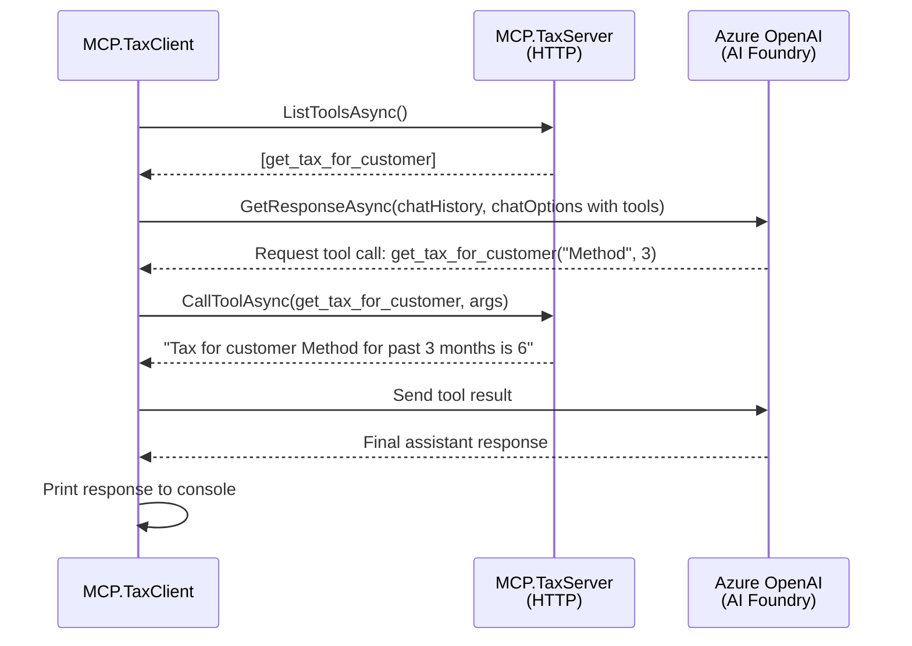
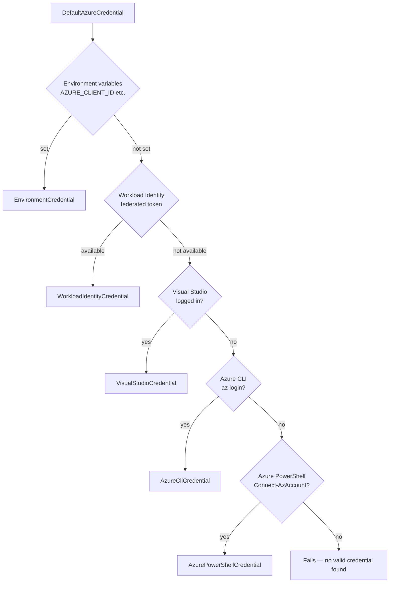
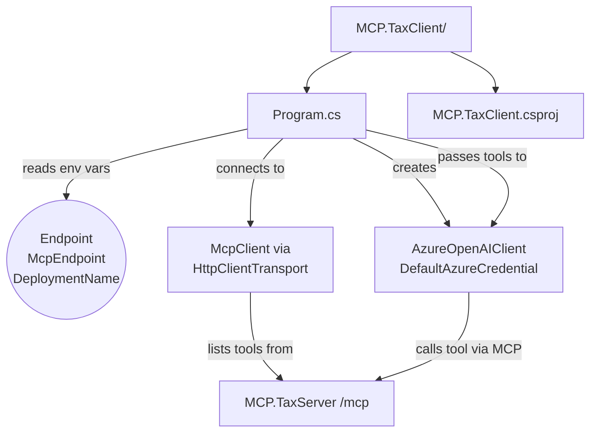

# MCP.TaxClient — MCP Client with Azure AI Foundry

This example shows how to build a console application that connects to a running MCP server, lists its tools, and passes them to an Azure AI Foundry chat-completion model backed by `DefaultAzureCredential`. The model decides when to invoke the tool and constructs the final response.

## How it works



## Prerequisites

| Requirement | Details |
|-------------|---------|
| .NET SDK | 10.0 or later |
| Azure subscription | Required to access Azure AI Foundry |
| Azure AI Foundry resource | With a chat-completion model deployed (e.g. `gpt-4o`) |
| Azure CLI or Visual Studio login | Used by `DefaultAzureCredential` for authentication |
| Running MCP.TaxServer | The server must be reachable at the URL set in `McpEndpoint` |

## Authentication

This application uses [`DefaultAzureCredential`](https://learn.microsoft.com/en-us/dotnet/api/azure.identity.defaultazurecredential) from `Azure.Identity`. It tries the following credential sources in order:



Run `az login` or sign into Visual Studio before running locally.

## Environment Variables

All three variables must be set before running:

| Variable | Description | Example |
|----------|-------------|---------|
| `Endpoint` | Full URI of your Azure OpenAI resource | `https://my-resource.openai.azure.com/` |
| `McpEndpoint` | URL of the running MCP.TaxServer `/mcp` endpoint | `http://localhost:5000/mcp` |
| `DeploymentName` | Name of the chat-completion deployment | `gpt-4o` |

The application throws `ArgumentException` immediately on startup if any variable is missing or empty.

### Setting variables (PowerShell)

```powershell
$env:Endpoint        = "https://my-resource.openai.azure.com/"
$env:McpEndpoint     = "http://localhost:5000/mcp"
$env:DeploymentName  = "gpt-4o"
```

### Setting variables (bash)

```bash
export Endpoint="https://my-resource.openai.azure.com/"
export McpEndpoint="http://localhost:5000/mcp"
export DeploymentName="gpt-4o"
```

## Project Structure



## Running the Application

Start the MCP.TaxServer first, then:

```bash
cd src/ADMcpExamples/MCP.TaxClient
dotnet run
```

## Key NuGet Packages

| Package | Purpose |
|---------|---------|
| `Azure.AI.OpenAI` | Azure OpenAI client |
| `Azure.Identity` | `DefaultAzureCredential` |
| `Microsoft.Extensions.AI` | `IChatClient`, `ChatOptions`, `ChatMessage` |
| `Microsoft.Extensions.AI.OpenAI` | `AsIChatClient()` extension |
| `ModelContextProtocol.Core` | `McpClient`, `HttpClientTransport` |
| `Spectre.Console` | Rich console output |

## Tests

Tests live in [`tests/MCP.TaxClient.Tests/`](../../tests/MCP.TaxClient.Tests/). Run them with:

```bash
cd tests/MCP.TaxClient.Tests
dotnet test
```

| Test file | What it covers |
|-----------|----------------|
| `EnvironmentConfigurationTests.cs` | Validates env var guards for `Endpoint`, `McpEndpoint`, and `DeploymentName` |
| `ChatConfigurationTests.cs` | Chat message construction: roles, content, and `ChatOptions` |
| `TransportConfigurationTests.cs` | `HttpClientTransportOptions` name and endpoint configuration |
