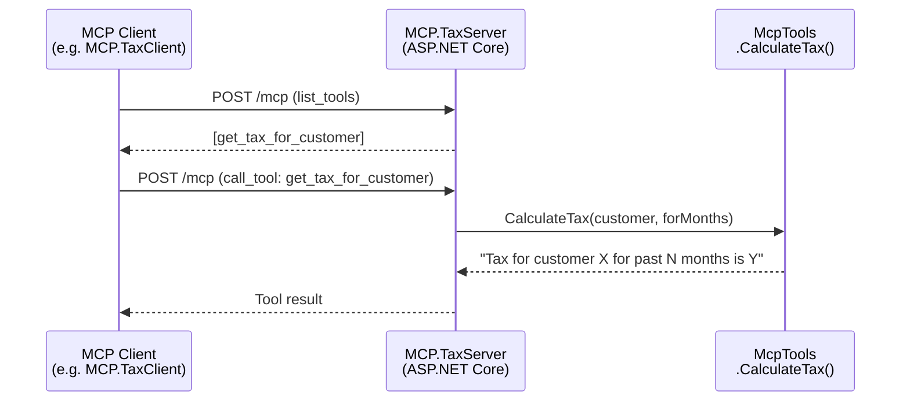

# MCP.TaxServer — MCP Server with HTTP Transport

This example shows how to build a stateless MCP server in ASP.NET Core that exposes a tax calculation tool over HTTP. It uses `ModelContextProtocol.AspNetCore` with a stateless HTTP transport and discovers tools automatically via reflection.

## How it works



## Prerequisites

| Requirement | Details |
|-------------|---------|
| .NET SDK | 10.0 or later |

No Azure credentials are required to run the server itself. The server is a plain ASP.NET Core application.

## Project Structure

```mermaid
graph TD
    A[MCP.TaxServer/] --> B[Program.cs]
    A --> C[Tools/McpTools.cs]
    A --> D[MCP.TaxServer.csproj]
    A --> E[appsettings.json]

    B --> |registers| F[AddMcpServer]
    B --> |HTTP transport| G[WithHttpTransport\nStateless=true]
    B --> |scans assembly| H[WithToolsFromAssembly]
    H --> |discovers| C
    B --> |maps| I[/health]
    B --> |maps| J[/mcp]
```

### `Program.cs`

Sets up the ASP.NET Core host with:
- MCP server with stateless HTTP transport
- Tool discovery from the assembly (picks up `[McpServerToolType]` classes)
- Health check endpoint at `/health`
- MCP endpoint at `/mcp`

### `Tools/McpTools.cs`

Contains the MCP tool exposed to clients:

```csharp
[McpServerToolType]
public class McpTools(ILogger<McpTools> logger)
{
    [McpServerTool(Name = "get_tax_for_customer")]
    public string CalculateTax(string customer, int forMonths)
}
```

Tax calculation logic:

| Customer value | Calculation | Example (3 months) |
|----------------|-------------|---------------------|
| `"Method"` | `forMonths × 2` | `6` |
| `"Tax"` | `forMonths ÷ 2` | `1.5` |
| anything else | `forMonths` unchanged | `3` |

## Endpoints

| Endpoint | Description |
|----------|-------------|
| `GET /health` | Health check — returns `Healthy` with HTTP 200 |
| `POST /mcp` | MCP protocol endpoint (stateless HTTP transport) |

## Running the Server

```bash
cd src/ADMcpExamples/MCP.TaxServer
dotnet run
```

The server listens on the default Kestrel port (typically `http://localhost:5000`). Point your MCP client to `http://localhost:5000/mcp`.

## Key NuGet Packages

| Package | Purpose |
|---------|---------|
| `ModelContextProtocol` | Core MCP types and attributes |
| `ModelContextProtocol.AspNetCore` | ASP.NET Core MCP server integration |

## Tests

Tests live in [`tests/MCP.TaxServer.Tests/`](../../tests/MCP.TaxServer.Tests/). Run them with:

```bash
cd tests/MCP.TaxServer.Tests
dotnet test
```

| Test file | What it covers |
|-----------|----------------|
| `McpToolsTests.cs` | Unit tests for `McpTools.CalculateTax` logic and MCP attribute decoration |
| `WebApplicationTests.cs` | Integration tests — health check and MCP endpoint registration |
